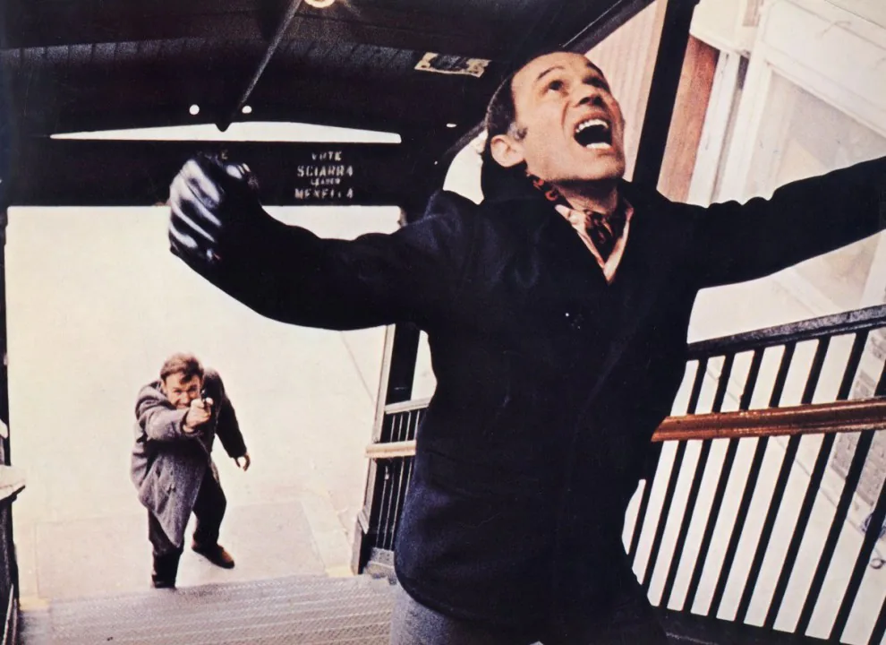

---
pdf_options:
  format: Letter
  margin: 0
  printBackground: true
css: |-
  /* Mirror the live article page (assets/css/style.css) with the lantern LIT,
     i.e. body.is-night: the room goes dark (#191309) and sits under a warm
     pool of light, while the sheet itself keeps its daytime paper and ink and
     gains a warm glow. So here the page is the dark room and the sheet floats
     inside it, rather than the sheet filling the page as in the day version. */
  @import url('https://fonts.googleapis.com/css2?family=Geist:wght@300;400;700&family=Merriweather:wght@300;400;700&family=Playfair+Display:wght@700&display=swap');

  /* The darkened room, plus the lantern's pool of light and its falloff —
     the two radial gradients from body.site-page::after. */
  html {
    background-color: #191309;
    background-image:
      radial-gradient(ellipse 58% 60% at 50% 44%, rgba(255, 191, 105, .06), transparent 62%),
      radial-gradient(ellipse 80% 78% at 50% 46%, transparent 42%, rgba(12, 8, 3, .48) 75%, rgba(8, 5, 2, .76) 100%);
  }

  /* The sheet stays exactly as it reads by day — night never touches the
     paper colour or the ink, only what surrounds them. */
  body {
    font-family: 'Merriweather', Georgia, serif;
    color: #342b23;
    background-color: #fbf9f3;
    background-image:
      radial-gradient(circle at 13% 18%, rgba(110,64,36,.032) 0 1px, transparent 2px),
      radial-gradient(circle at 87% 72%, rgba(130,76,39,.036) 0 1px, transparent 2.3px),
      repeating-linear-gradient(0deg, rgba(89,62,38,.015) 0 1px, transparent 1px 4px);
    background-size: 47px 43px, 59px 61px, 100% 4px;
    /* The margin is what lets the dark room show around the sheet on every
       page; the padding is the sheet's own breathing room. */
    max-width: none;
    margin: 7mm;
    padding: 13mm 17mm;
    font-size: 15.5px;
    line-height: 1.76;
    text-align: left;
    /* .site-page--post.is-night .article-paper: dropped into the dark, lit
       from the lantern. */
    box-shadow:
      0 18px 30px rgba(0, 0, 0, .6),
      0 0 46px rgba(255, 185, 95, .14);
  }

  h1, h2, h3 {
    color: #30271f;
    font-family: 'Playfair Display', Georgia, serif;
    line-height: 1.2;
  }

  h1 { font-size: 44px; text-wrap: balance; }

  /* The small caps date line, exactly as .article-date renders it. */
  .article-date {
    margin: 0 0 32px;
    color: rgba(52, 43, 35, .56);
    font-family: 'Geist', sans-serif;
    font-size: 11px;
    font-weight: 400;
    letter-spacing: .14em;
    text-transform: uppercase;
  }

  img {
    box-sizing: border-box;
    display: block;
    max-width: 100%;
    height: auto;
    margin: 26px auto;
    border: 0;
    border-radius: 0;
    filter: sepia(.04) saturate(.96);
    box-shadow: 0 8px 22px rgba(63, 39, 19, .15);
  }

  /* The capped inline images, as .post-inline-image renders them. */
  img.post-inline-image {
    width: auto;
    max-width: min(74%, 620px);
    max-height: 430px;
  }

  a { color: inherit; }

  /* The centred pull quotes: parchment panels in italic Merriweather. */
  div[style*="background-color: #fcfcfc"] {
    background: rgba(246, 242, 232, .72) !important;
    border-color: rgba(102, 67, 39, .14) !important;
    border-radius: 2px 8px 3px 6px !important;
    font-family: 'Merriweather', Georgia, serif;
    font-style: italic;
    font-weight: 400 !important;
    font-size: 1.24em !important;
    line-height: 1.65 !important;
    page-break-inside: avoid;
  }

  h1, h2, h3 { page-break-after: avoid; }
---

August 16, 2026

  <h1><strong>The Greater Fool is the Only Thing Crypto Ever Built</strong></h1>

  <!-- Adds extra spacing -->

As time pass by, I have come to this definitive conclusion that I never go to rooms where crypto people sit. I politely walk away.

This would appear controversial and offend few, however- Over a period of years, I have never "judged" someone on what profession they do. As long as you are earning an honest day's labor, not illegal, I would love to talk to anyone. And enjoy talking.

Enjoy learning about their life, their work. Would ask lots of questions about their discipline if it's something I don't have much knowledge of. To learn something about it.

However, as you grow older, you realize that at the end of the day— intellectual honesty and honesty of character is what motivates you to know somebody. It's not how much money they have, or how good looking they are. Those are ephemeral things.

What keeps the excitement in a conversation is if someone is intellectually honest to talk and has an honesty of character.

People who work in crypto unfortunately are totally devoid of it.

I have spent enough time listening to their arguments. Did every talk of Economics, of Money, even the technology underpinnings of it.

And every single time it would end up with the crypto people getting defensive and angry at you for not agreeing with their belief— as logic evades them.

It is the single profession (if you call it a profession)— where you can only be in it if you are either intellectually dishonest, purposely self delusional, dishonest character or all of them.

Gambling and speculation exists legally in society. But a casino owner in Vegas isn't shilling you the "world changing" ambition of the casino table. He is honest— has even restrictions on what age can enter and you know you are in it to gamble and run your lottery.

Crypto is the worst of worse.

The entire existence of this is based on Greater Fool Theory. How can we find more gullible, naive ppl to mislead them into talking of libertarian ideas of freedom, while swindling them of their real money for Monopoly Money.

In 2022, at the peak of Crypto and Web3, I wrote about all of this in detail, equating Web3 with an MLM Ponzi scheme.

There is no intellectual honesty, a character based on grifting others with grandiose spiel and everything runs on performance art.

It's the only discipline where anyone becomes a CEO of a crypto startup — in 2021, I knew few contract recruiters who became CEO of a crypto startup.

And the only profession where everyday activity revolves around frequent media interviews, paid by the same crypto industry and posting about it online to make yourself feel "important" to others so they can take you seriously as you have nothing else to show of beside selling vaporware.

It was one thing if one got deluded ten years ago believing in what certain small section of ppl made millions to believe — but if you are still working in crypto in 2026 and that's the only thing you have done in your career— intellectually dishonest and dishonest character is the only thing behind it.

And just like every religion — you can never reason with crypto people because their existence is not based on honesty but grift

It's on a belief that one day I will become rich hoping these worthless tokens would get a bubble when millions around the world are fooled again.

Until then I will preach my misguided understanding of Hayek and Mises' libertarian ideas of freedom.
