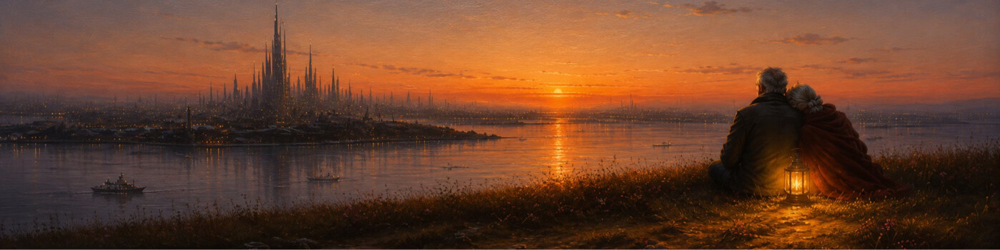

---
pdf_options:
  format: Letter
  margin:
    top: 25mm
    right: 20mm
    bottom: 25mm
    left: 20mm
  printBackground: true
css: |-
  @import url('https://fonts.googleapis.com/css2?family=Geist:wght@300;400;600;700&display=swap');

  body {
    font-family: 'Geist', -apple-system, BlinkMacSystemFont, sans-serif !important;
    background: white;
    color: #444;
    font-size: 15px;
    line-height: 1.7;
    max-width: 800px;
    margin: 0 auto;
    padding: 0;
  }

  p {
    margin-top: 0;
    margin-bottom: 10px;
  }

  h1 {
    font-size: 36px !important;
    font-weight: 600 !important;
    color: #444 !important;
    margin-top: 20px;
  }

  h3 {
    font-size: 22px !important;
    font-weight: 600 !important;
    color: #444 !important;
    margin-top: 30px;
  }

  strong {
    font-weight: 700;
  }

  img {
    max-width: 100%;
  }
---

**June 6, 2026**

  <h1><strong>The Last Scarce Things</strong></h1>

 

 

For a long time, I have held a strong thesis that too much technology is eventually bad for society. A boon for capitalism. A bane for the soul of a society.

Two hypotheses have sat quietly underneath that thesis for years:

**Technology and critical thinking in a society are inversely related.** The more the technology, the dumber the society. Every tool that thinks for us is one less reason for us to think at all.

**Technology and the lack of humanity are directly related.** The more technology pervades a society, the more it strips people of human connection, the quiet fabric that has held us together for centuries. And that fabric does not tear loudly. It frays. Thread by thread. Almost invisibly. Until one day a society looks around and cannot remember how to hold itself.

This has been the core reason why, while I have spent my life working in this very industry, I have always felt disconnected from the ecosystem and the values it propagates. I have always felt excited, even energized, by conversations about innovation, about new things to build. But the transactory conversations of Silicon Valley never felt enticing.

It is why I have barely maintained an online presence. I deleted Facebook a decade ago, and never saw the appeal of Instagram or TikTok. And to be clear, having technology automate the mundane and hand us back our time, so we can spend it on the people we love, is a beautiful thing. What I never bought into is the "OpenClaw-ism" of the Valley—adding every new agent to every corner of your life, until nothing in it is actually lived by you. Somehow, I have kept myself deeply involved, technically, in every AI advancement, building with these tools every single day, and yet somehow managed to keep them from ever touching the part of my life that actually breathes.

Perhaps because, somewhere along the way, I discovered where my heart actually lives.

There is a quiet ache in watching a stranger cry, and feeling the urge to walk over and simply say *hello*. A tenderness in holding the hand of an old woman trying to cross the street. A warmth in seeing someone completely unknown to me share the news of their wedding, and feeling my own heart lift, as if it were the news of an old friend.

These small, unprofitable moments—some joyful, some sad, all deeply human—have always felt more heart-warming to me than any AI-driven euphoria someone managed to attain for themselves or their business.

And I also came to see that barely anyone in the Valley seems to care about a world that exists and breathes outside San Francisco. And pushing our tech-driven dystopian vision onto that world is going to have debilitating effects across society.

So I began to sit with a harder question. **What happens after?**

After technology has taken over, after most of our jobs are gone, after everything can be built so easily that building itself means nothing. When anyone can make anything, yet so few carry the Taste and Imagination to build what is meaningful, or the agency to see it through. In that world, what is even meaningful anymore?

And the more I have thought about it, the more life has moved me forward, the more I keep arriving at the same simple answer.

In the end, only two things will really matter.

Two things that will become the scarcest things of all as technology completes its slow zombification of society. More so now, when we have willingly handed it our lives.

 

### I. Find someone to love deeply and care for in life.

There is nothing more scarce in life than to find someone you truly love and care for, and to be loved and cared for by them in return.

Waking up every morning caring for a life around you is the most meaningful thing that will keep you going. Even in a post-apocalyptic world.

Falling in love completely. Totally. With all your heart. Not wanting anything from them besides their well-being, their presence, and their warm embrace. Yearning for the smallest things: to see their face, to hear their voice, to know their scent.

**And then living that love in the most ordinary ways.**

Learning exactly how they take their tea, and making it for them anyway, every morning, without being asked. Tilting the umbrella toward them in the rain and pretending you aren't getting wet.

Tucking a loose strand of hair behind their ear while they are mid-sentence about their day. Sitting in the same room reading different books, saying nothing, and somehow saying everything. Dancing badly with them in the kitchen to a song older than both of you.

Listening to their problems. Comforting them. Feeding them. Reminding them of their appointments. Taking walks together with no destination at all, because the walk was never about getting anywhere. It was about their hand in yours.

Waking up every morning beside them, seeing their messy hair—and still finding them the most beautiful sight in the world. Teasing them.

Fighting with them over nothing and making up over even less. And then growing old with them through all of it. Watching their hair slowly turn silver and loving it more than the color it replaced. Holding their wrinkled hand in a hospital waiting room without either of you needing to say a word.

Bringing another life into this world together, making a promise together to care for that new life, protecting it as it grows in front of both your eyes, and one day watching that life walk out into the world, while you two remain, side by side, where it all began.

**The actual big acts in life are when you propose to someone you love.**

Forget all the other stuff. If you made the right decision, and you get the right answer from him or her, you are ninety percent of the way home in life.

Because when machines have taken over everything flashy, everything fast, everything impressive, the rarest, most meaningful thing left will be this: someone you deeply love, and the ordinary, everyday things you get to do with them.

This will give you more joy and purpose than any job, any title, any amount of money ever will.

And yet, **this has become one of the scarcest things in life.**

Technology has led everyone to chase hedonism over real, meaningful relationships.

Our values are now measured by the size of someone's bank balance, rather than by whether they are the one who will sit beside us when everything else falls away. Money is important, it buys us Time. But beyond a certain amount, no money will ever give you more joy than a warm, caring embrace from someone who only cares for your well-being—truly and genuinely.

    In a world where machines can do everything, the only thing left worth doing is to love someone—completely, simply, every ordinary day.

 

### II. Carry your authenticity.

In a world dominated by AI, perfection is no longer scarce. It is abundant. It is a commodity. Anyone can project themselves as the perfect embodiment of whatever they want the world to believe about them. It has never been easier to build a great Reputation.

**But Character is what you truly are. Reputation is merely what you want others to know who you are.**

The authenticity that would get socially scoffed at until now, because you refused to agree with the masses, will become the only way to survive. When everyone can generate the perfect image, the perfect words, the perfect life, perfection loses all its meaning.

The beauty will shift from Perfection to Imperfection.

To the cracks. To the unpolished. To the trembling voice that means every word it says. To the real.

    When machines make perfection abundant, imperfection becomes the new beauty. Character becomes the new wealth. And purity of heart—already a rarity—becomes the rarest thing in the world.

 

Those who carry purity in their heart, a rarity already, will be the ones the world quietly gravitates toward, when everything else around them is generated, optimized, and artificial.

So this is where I have landed, after all these years of building the very thing I have been wary of. The machines will take the jobs. They will write the words, paint the images, run the businesses. They will hand us perfection at zero cost.

And when that happens, the only things left standing—the only things that were ever really ours—will be the person whose hand you hold, and the person you actually are when no one is watching.

And when I picture that world, I do not picture its towers or its glittering skylines.

I picture two people grown old together on a quiet hillside outside the city—a small lantern between them, her head resting on his shoulder—watching the lights of a civilization that no longer needs them.

And needing nothing but each other.

Everything else, technology will replicate.

These two things, it never will.
