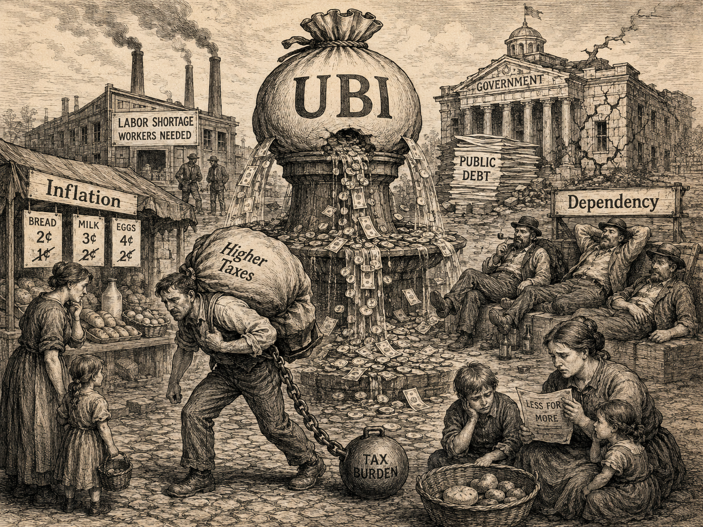

---
pdf_options:
  format: Letter
  margin:
    top: 20mm
    right: 20mm
    bottom: 20mm
    left: 20mm
  printBackground: true
css: |-
  @import url('https://fonts.googleapis.com/css2?family=Geist:wght@300;400;600;700&display=swap');

  body {
    font-family: 'Geist', -apple-system, BlinkMacSystemFont, sans-serif !important;
    background: white;
    color: #444;
    font-size: 15px;
    line-height: 1.7;
    max-width: 800px;
    margin: 0 auto;
    padding: 0;
  }

  p {
    margin-top: 0;
    margin-bottom: 13px;
  }

  h1 {
    font-size: 36px !important;
    font-weight: 600 !important;
    color: #444 !important;
    margin-top: 20px;
  }

  h3 {
    font-size: 22px !important;
    font-weight: 600 !important;
    color: #444 !important;
    margin-top: 30px;
  }

  strong {
    font-weight: 700;
  }

  img {
    max-width: 100%;
  }
---

**June 20, 2026**

  <h1><strong>UBI is the Bane of a Functioning Society</strong></h1>

 

 

Let me say upfront that I know this is a controversial opinion. It runs against the grain of what most kind, well-meaning people believe, and against what an increasingly loud chorus in technology and academia has been advocating. But I have sat with it long enough to believe it is true, and I would rather be honestly unpopular than comfortably wrong.

One of the core ideas floated over the last few years, usually sprung up by the rich class, is Universal Basic Income (UBI).

Dario Amodei of Anthropic has recently suggested that since a large share of entry to mid-level white collar jobs is going to disappear due to AI, we should start thinking about some form of taxation to fund a UBI that supports the people left behind. Elon, ever willing to rebrand anything that aligns with his self-interest, has gone a step further and coined a better-sounding term, Universal High Income (UHI).

The core idea, shared by its supporters across academia, the wealthy, and even many who are themselves struggling, is to give society a minimum cushion. A monthly sustenance that takes care of basic living, so that people are freed to focus on bigger things that benefit everyone.

On the surface, it appears a kind and noble idea.

After all, in a just society, one should want everyone to thrive, to live decently, to not have to struggle merely to exist. That is the world I want to see around me every single day.

And yet, I believe it is a seemingly noble idea wrapped around a bane for society. Because it violates the most fundamental truth of how human behavior actually works.

    Nothing of meaning, purpose, or value in our history has ever been built by men who had life on easy mode.

 

**Suffering is the core of human existence.**

It is the single strongest force in the shaping of human Character.

This is because most people do not know what their passion is. Most people will never know what their purpose is. More often than not, it is circumstance. It is hardship. It is the sheer weight of Suffering that forces a person to strive, to fight, to change their situation.

And because Money is the functioning rail of modern society, the rail on which nearly all of everyday life runs, the desire to make Money becomes, for most people, the engine of their Ambition. For some, it goes further. Because Money is Power, the hunger to accumulate extreme amounts of it, to wield that Power, becomes the very thing that drives them out of bed each morning.

Strip that away, and you are left with a quieter, more uncomfortable truth. Without an innate drive to do things, most people simply do not push themselves. Not for the lure of Money. Not for the pursuit of Power. Not even to escape their own Suffering.

There is a saying that captures this cycle better than I ever could:

    "Hard times create strong men. Strong men create good times. Good times create weak men. And weak men create hard times."
      
    — G. Michael Hopf

 

History is, in many ways, just this sentence playing out on a loop.

Andrew Carnegie arrived in America as a penniless immigrant and went to work in a cotton mill as a boy, earning barely over a dollar a week. The man who would go on to build the steel that built modern America did not begin in comfort. He began in want.

Look at entire nations and the pattern only sharpens. The generation that crawled out of the rubble of post-war Germany and Japan, with nothing but ash and humiliation behind them, rebuilt their countries into economic powerhouses within a few decades. The very hardship that should have broken them became the forge that made them. Their children, raised in the comfort their parents bled for, would never have to summon that same ferocity, and largely never did.

**Suffering, it turns out, is not the enemy of greatness. It is most often its origin.**

This is precisely where UBI works against its own stated intention. The noble voice behind it says: free people from worrying about their basic needs, and they will be liberated to build great things for society.

But the exact opposite is what happens when you hand people free money.

**The desire to be ambitious quietly dies.** The motivation to strive evaporates. The Suffering that once lit the fire is no longer there. The bottom rungs of Maslow's hierarchy are covered. And once they are covered, the very drive to climb higher dissolves.

And this is not theory. We have run this experiment before, more than once.

In 1795, the English parish of Speenhamland introduced a system that, in spirit, was an early form of basic income. Wages were topped up from public funds to guarantee every family a minimum livelihood, indexed to the price of bread. It was profoundly well-intentioned.

And it was, by most later accounts, a catastrophe. Employers slashed wages knowing the parish would make up the difference. Workers lost the incentive to work harder than the bare minimum, since effort no longer changed their income. An entire class of laborers was slowly pauperized, made dependent, stripped of the dignity and drive that work had once given them. The cure deepened the disease.

We saw a faster, sharper version of the same thing in our own lifetime.

During the pandemic, governments rightly rushed emergency stimulus and enhanced unemployment benefits to people. But for a large share of lower-wage workers, those benefits paid more than their actual jobs did. And so a perfectly rational thing happened. Why work ten hours a day for a full paycheck when you could stay home and collect seventy-five percent of it, or more, for nothing? Businesses desperately wanted workers back. Workers, doing nothing more than responding sensibly to the incentives placed in front of them, often chose not to return. It was not laziness. It was human nature, behaving exactly as human nature does.

    You cannot pay a society to stay hungry. The moment its hunger is satisfied for free, its ambition goes to sleep.

 

It is worth pausing here, because the most serious thinkers on freedom never argued that society should let its weakest simply fall. Even Friedrich Hayek, the great defender of free markets and the author of *The Road to Serfdom*, accepted that a society as wealthy as ours can and should guarantee a floor. He wrote that "some minimum of food, shelter, and clothing, sufficient to preserve health and the capacity to work, can be assured to everybody," and that this kind of security could be provided to all without endangering general freedom.

But notice the line he drew, because the entire argument lives inside it.

Hayek separated two very different kinds of security. The first was security against destitution: a minimum floor beneath which no one, especially those genuinely unable to provide for themselves, need fall. This he embraced. The second was the security of a given standard of living, a guarantee of one's relative comfort and position compared to others. This he warned against in the sharpest possible terms, because to deliver it the state must seize ever more control over how people live, work, and are rewarded. That, he argued, is the road to serfdom.

UBI, in its universal and unconditional form, quietly steps across that very line. It is not a floor for those who have fallen. It is a standard of living handed to everyone alike, whether they have fallen or not, whether they strive or not. And the moment sustenance is severed from any need to contribute, when even the capacity to work, the very thing Hayek wanted his floor to protect, is no longer asked of anyone, you have not built a safety net.

There is also a deeper, quieter danger in all of this.

When the majority of a society comes to rest on the doles handed down by the wealthy and the political class, it does not merely lose its work ethic. It loses something far more precious.

**It loses the muscle to suffer. To struggle. To build.**

And a people who can no longer build for themselves become a people who must depend on others to build for them.

That dependence is never free.

A society where most people rely on the state and the rich for their basic sustenance is a society that has quietly handed over its leverage. Power concentrates further into the hands of the few who fund the doles, while the many, comfortable but captive, slowly surrender their voice, their agency, and their right to truly say no. You do not bite the hand that feeds you. And a society that will not bite is a society that can be led anywhere.

This is the cruel inversion at the heart of UBI. Sold as the great equalizer, it may well become the great pacifier. A gilded cushion that, in softening the fall, also robs people of the very reason to ever stand up and climb.

I want a world where no one suffers needlessly. I want that more than almost anything.

But the answer to suffering was never to anesthetize it with free money. It was to give people the tools, the opportunity, and the dignity to fight their way out of it themselves.

Because in that fight, and only in that fight, is where human beings have always become who they were meant to be.
